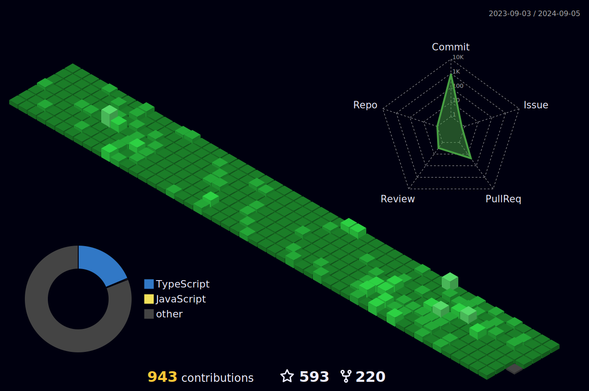

<!-- : [See here!](https://www.linkedin.com/feed/update/urn:li:activity:7190462861754720256/) -->
<!--  # Software Engineer & Tech Trainer 🖥️.  -->
<h1> Software Engineer & Tech Trainer 🖥️. </h1>

# Top th Pakistani Github Contributor.

<h2><i>Empowering Minds Through Code.</i></h2>
<!-- 

 

  -->

<!-- # Hi there, I'm Ahmad Jajja 👋. -->

<!-- ##  -->

<!-- ## Learn with Ahmad Jajja :mailbox_with_mail: &nbsp;&nbsp;&nbsp;&nbsp;&nbsp;&nbsp;&nbsp;&nbsp;&nbsp;&nbsp;&nbsp;&nbsp;&nbsp; Wanna see glimpses of how I train? Click below ⬇️ -->
<!-- 

  <b style="display: inline-block; margin-right: 20px; font-size: 2.5em; ">Learn with Ahmad Jajja 📬</b>
  
  
  <b style="display: inline-block;font-size: 1.5em;">Wanna see glimpses of how I train? Click on the picture!</b>

 -->

<!--  -->
<a href="https://drive.google.com/file/d/1VoW3VGwb0dlfR0XMFlPWOvK1b47_CcIK/view" target="_blank" >
<!-- <i style="position: absolute; right : 1;top: 20%; z-index: 3">Saylani Mass IT Training Program</i> -->

</a>	

<!--  -->

| TECH SESSIONS @SMIT                                                                                         |
| :---------------------------------------------------------------------------------------------------------- |
| [Full_Stack_Development_1.0](https://github.com/Ahmadjajja/SMIT-Web-and-Mobile-Batch7) (Current)            |
| [GenAI-Chatbot 1.0](https://github.com/Ahmadjajja/AI-Chatbot) (Current)                                     |
| [Backend_Development_1.0](https://github.com/Ahmadjajja/Backend_Development.git) (Completed)                |
| [Web Designing Bootcamp 1.0](https://github.com/Ahmadjajja/Web_Designing_Crash_Course_A) (Completed)        |
| [Web Designing Bootcamp 2.0](https://github.com/Ahmadjajja/Web_Designing_Crash_Course_B) (Completed)        |
| [Frontend_Web_Development_1.0](https://github.com/Ahmadjajja/SMIT-WMA-6-A-E) (Completed)                    |
| [Frontend_Mobile_Development_1.0](https://github.com/Ahmadjajja/Mobile_Application_Development) (Completed) |
| **TECH SESSIONS @iCodeGuru**                                                                                    |
| [DSA(LeetCode)_Volunteer_Teaching](https://github.com/Ahmadjajja/LeetCode_Volunteer_Teaching) (Current)     |
| [ML_and_its-privacy-implications](https://github.com/Ahmadjajja/Machine-Learning_and_its-privacy-implications) (Current)             |

- Co-Founder & Dev Lead @[EcoFactor](https://ecofactorsite.netlify.app/).
- Solved 300+ Data Structures & Algorithms problems on **[Leetcode](https://leetcode.com/ahmadjajja86/)**.
- **@[SMIT](https://www.linkedin.com/feed/update/urn:li:activity:7094647856233365504/)**: Trained 1000+ students to learn programming and software engineering skills.
- If you want to see how I provide training to my students @SMIT, have a look → **[**👀**](https://drive.google.com/file/d/1VoW3VGwb0dlfR0XMFlPWOvK1b47_CcIK/view)**
- **@[iCodeGuru](https://icodeguru.weebly.com/)**: Offers volunteer teaching in Python and DSA, emphasizing LeetCode.
- **@lablab.ai**: [Participated](https://lablab.ai/u/@ahmad_jajja288) in multiple AI International Hackathons with a global team of six.
- **@lablab.ai**: [Winner](https://www.linkedin.com/feed/update/urn:li:activity:7176624410651504641/) of an International Hackathon(Unhallucinate Challange).
- **@Stanford University**: [Selected](https://www.linkedin.com/feed/update/urn:li:activity:7186385467846639620/) as a Section Leader to teach Python to 100+ international students, then **[promoted to Section Leader Mentor](https://www.linkedin.com/posts/ahmad-jajja_stanfordabrcodeabrinabrplaceabrlearnings-activity-7195142429073633281-zNhV/?utm_source=share&utm_medium=member_desktop)** to provide one-on-one support.
- **@Harvard University(CS50x_PuzzleDay_Winner)**: Our team [won 1st place](https://www.linkedin.com/feed/update/urn:li:activity:7184212040717131778/) at CS50x Puzzle Day 2024 by solving 9/9 complex
puzzles.
<!-- - 📫 How to reach me **ahmadjajja86@gmail.com** -->

<h2><i>💻 Tech Stack and Tools</i></h2>

<table width="100">
<tr>
    <td align='center' width="190">
        
    </td>
    <td align='center' width="190">
        
    </td>
     <td align='center' width="190">
        
    </td>
     <td align='center' width="190">
        
    </td>
     <td align='center' width="190">
        
    </td>
</tr>
<tr>
    <td align='center'>
        
    </td>
    <td align='center'>
        
    </td>
    <td align='center'>
        
    </td>
    <td align='center'>
        
    </td>
    <td align='center'>
        
    </td>
</tr>
<tr>
    <td align='center'>
        
    </td>
    <td align='center'>
        
    </td>
    <td align='center'>
        
    </td>
    <td align='center'>
        
    </td>
    <td align='center'>
        
    </td>
</tr>
<tr>
    <td align='center'>
        
    </td>
    <td align='center'>
        
    </td>
    <td align='center'>
        
    </td>
    <td align='center'>
        
    </td>
    <td align='center'>
        
    </td>
</tr>
<tr>
    <td align='center'>
        
    </td>
    <td align='center'>
        
    </td>
    <td align='center'>
        
    </td>
    <td align='center'>
        
    </td>
    <td align='center'>
        
    </td>
</tr>

<tr>
    <td align='center'>
        
    </td>
    <td align='center' width="190">
        
    </td>
    <td align='center'>
        
    </td>
    <td align='center'>
        
    </td>
     <td align='center'>
        
    </td>
</tr>

</table>

 
 

## Connect with Me 🤝

  
 ## Some Community Projects & Resources

| Project :octocat:                                                                                           | Issues :bug:                                                                                                                                                                                                         | Open PRs :bell:                                                                                                                                                                                        | Closed PRs :fire:                                                                                                                                                                                                                                 |
| ----------------------------------------------------------------------------------------------------------- | -------------------------------------------------------------------------------------------------------------------------------------------------------------------------------------------------------------------- | ------------------------------------------------------------------------------------------------------------------------------------------------------------------------------------------------------ | ------------------------------------------------------------------------------------------------------------------------------------------------------------------------------------------------------------------------------------------------- |
| [**Tech Books**](https://github.com/Ahmadjajja/LearnTechBooks)                                              |                              |                                           |                                          |
| [**Awesome Python Projects**](https://github.com/Ahmadjajja/Awesome-Python-Projects)                        |                          |                         |                        |
| [**Python For Ethical Hacking**](https://github.com/Ahmadjajja/Python-For-Ethical-Hacking/)                 |                    |                   |                  |
| [**Learn Blockchain in 3 months**](https://github.com/Ahmadjajja/Learn-Blockchain-in-3-months)              |                |               |              |
| [**Learn-Data-Science-in-3-months**](https://github.com/Ahmadjajja/Learn-Data-Science-in-3-months)          |            |           |          |
| [**Learn_Machine_Learning_in_5_Months**](https://github.com/Ahmadjajja/Learn_Machine_Learning_in_5_Months/) |  |  |  |

<!--   ## Consistency👨‍💻
  

  

  
&nbsp;
  -->

  <h2><i>⚙️ GitHub Analytics</i></h2>

  

<!-- # Github Contributions
<h4 align="center">Isometric view of contributions in the last year.</h4>

	

 -->

<!-- # Github Metrics

	

 -->
